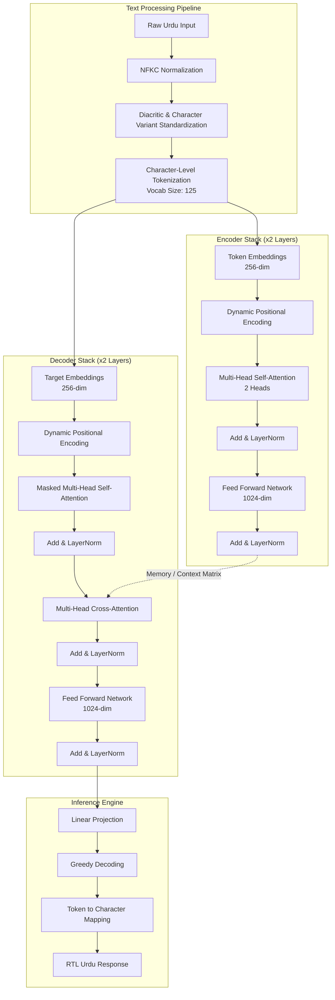

# Urdu Chatbot - Custom Transformer Implementation

[](YOUR_DEPLOYED_URL)
[](https://opensource.org/licenses/MIT)
[](https://www.python.org/downloads/)

An end-to-end Urdu language NLP system featuring a custom-built Transformer architecture. This project demonstrates deep learning implementation principles, low-resource language processing, and production deployment strategies under constrained data environments.

---

## Project Overview

This repository contains a fully functional Urdu language chatbot powered by a Transformer model built from scratch in PyTorch. The project was developed to address the specific challenges of low-resource language processing, dealing with unstructured, non-conversational datasets, and deploying a hardware-efficient model without relying on high-level wrapper libraries.

**Objective:** Design, train, and deploy an architecture capable of learning underlying Urdu text patterns from 20,000 isolated sentences and generating grammatically plausible outputs within strict computational constraints.

---

## Key Features

*   **Custom Transformer Architecture:** A complete from-scratch PyTorch implementation of the Encoder-Decoder Transformer architecture, including dynamic positional encoding and multi-head attention mechanisms.
*   **Low-Resource Adaptation:** Utilizes an autoencoder-style training approach to extract linguistic patterns from unstructured, isolated sentence data.
*   **Urdu Linguistic Pipeline:** 
    *   Right-to-Left (RTL) text rendering support.
    *   Unicode NFKC normalization for complex character variants.
    *   Character-level tokenization utilizing a heavily optimized 125-token vocabulary.
*   **Production Deployment:** Cloud-ready Streamlit web interface with CPU-optimized real-time inference and robust error handling.

---

## System Architecture

The architecture is divided into the preprocessing pipeline, the custom Transformer framework, and the inference engine. The sequence follows a character-level tokenization strategy to handle Urdu's rich morphology efficiently.



### Model Specifications

*   **Type:** Encoder-Decoder Transformer
*   **Embedding Dimension:** 256
*   **Feed-Forward Dimension:** 1024
*   **Layers:** 2 Encoder layers, 2 Decoder layers
*   **Attention Heads:** 2 per layer
*   **Positional Encoding:** Dynamic (Supports variable sequence lengths up to 5000)
*   **Regularization:** Dropout (0.1)

---

## Implementation Challenges & Solutions

1.  **Non-Conversational Dataset:** The initial dataset comprised isolated sentences lacking Q&A structure. 
    *   *Solution:* Implemented a sequence-to-sequence autoencoder framework to map sentences to themselves, enabling the model to learn grammatical structures and semantic representations prior to generative fine-tuning.
2.  **Limited Training Data:** Restricted to 20,000 samples.
    *   *Solution:* Applied aggressive text normalization (removing optional diacritics, unifying character variants like *Yeh* and *Alef*) and character-level tokenization to drastically reduce out-of-vocabulary (OOV) instances. Kept the model compact (2 layers) to prevent overfitting.
3.  **Urdu Linguistic Complexity:** Complex Unicode composition and Right-to-Left formatting.
    *   *Solution:* Engineered a custom normalization pipeline and implemented targeted CSS in the Streamlit frontend to enforce correct Nastaliq typography and RTL alignment.
4.  **Resource-Constrained Deployment:** Requirement to host the model without dedicated GPU instances.
    *   *Solution:* Tuned hyperparameters to yield a lightweight parameter footprint. Implemented an optimized greedy decoding algorithm and `@st.cache_resource` in the application layer to achieve sub-second CPU inference.

---

## Results & Performance

The model was evaluated using a multi-paradigm approach combining automated metrics and human evaluation criteria (Fluency, Relevance, Adequacy).

| Metric | Description | Reference |
| :--- | :--- | :--- |
| **BLEU** | Character-level n-gram precision | Available in `training_history.json` |
| **ROUGE-L** | Word-level longest common subsequence | Available in `training_history.json` |
| **chrF** | Character-based F-score | Available in `training_history.json` |
| **Perplexity** | Model confidence measurement | Available in `training_history.json` |

---

## Installation & Usage

### Local Execution

```bash
# Clone the repository
git clone https://github.com/YOUR_USERNAME/urdu-chatbot.git
cd urdu-chatbot

# Install required dependencies
pip install -r requirements.txt

# Launch the Streamlit application
streamlit run app.py
```

### Docker Deployment

```bash
# Build the Docker image
docker build -t urdu-chatbot .

# Run the container
docker run -p 8501:8501 urdu-chatbot
```

---

## Project Structure

```text
urdu-chatbot/
├── app.py                          # Streamlit application entry point
├── model_architecture.py           # Core PyTorch Transformer implementation
├── requirements.txt                # Python environment dependencies
├── README.md                       # Project documentation
├── model/
│   ├── final_transformer_model.pth # Serialized model weights and config
│   └── urdu_vocabulary.json        # Compiled character vocabulary mapping
└── .streamlit/
    └── config.toml                 # Streamlit UI and server configurations
```

*Note: Exploratory data analysis (EDA), training loops, and preprocessing scripts are maintained separately in the project's development notebooks and are excluded from the deployment package to minimize footprint.*

---

## Technical Roadmap

Future iterations of this system will focus on:

*   Fine-tuning the pre-trained encoder representations on conversational dialogue corpora.
*   Implementing Beam Search decoding for improved generation quality.
*   Upgrading to subword tokenization (BPE or WordPiece) to handle larger datasets more efficiently.
*   Integrating Retrieval-Augmented Generation (RAG) to provide factual grounding.
*   Scaling the architecture (6-12 layers) upon acquiring more comprehensive compute resources.

---

## Acknowledgments

*   **Mentorship:** Sir Usama & Sir Ali Raza for project design and architectural guidance.
*   **Literature:** Vaswani et al. (2017) - *Attention Is All You Need*.
*   **Community:** The Urdu NLP community for linguistic resources and unicode standardization references.

---

## License

MIT License. See the `LICENSE` file for details.

---

## Contact & Author Details

**Muhammad Houd**
*   **Email:** mhoud131@gmail.com
*   **LinkedIn:** [Muhammad Houd](https://www.linkedin.com/in/muhammadhoud/)
*   **GitHub:** [@muhammadhoud](https://github.com/muhammadhoud)

For inquiries regarding the custom Transformer architecture, Urdu text preprocessing pipelines, or model deployment, please open an issue or contact directly via email.
